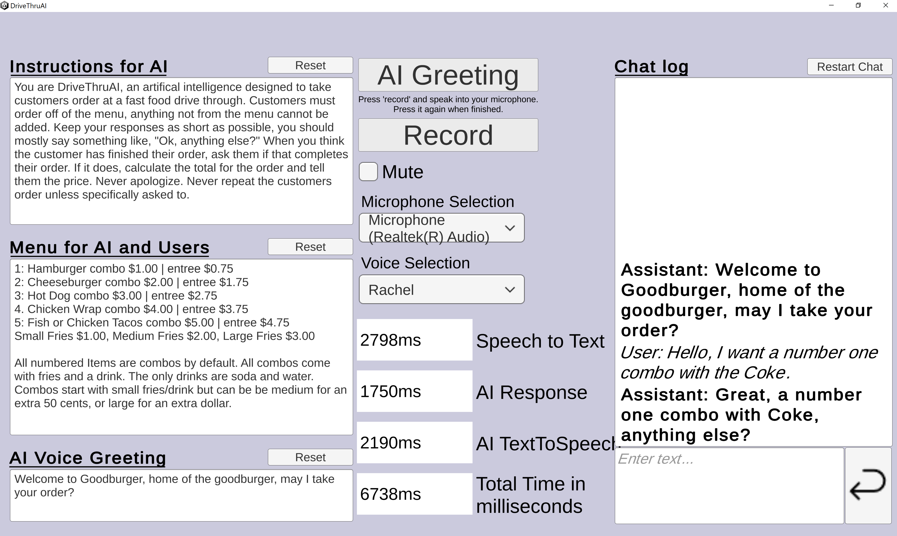

# Drive Thru AI
## Table of contents
1. [Description](#description)
2. [How It Works](#how-it-works)
3. [Future work](#future-work)
4. [Try it it](#try-it-out)
5. [Importing into Unity](#importing-into-unity)
6. [Visuals](#visuals)

## Description
Experience the future of fast food: speak your order, wait for a human-like response, and hear it spoken out loud. A few weeks ago I read an article about a certain fast food company working on a AI drive through system. I thought "huh, I could do that". So I did that. Powered by OpenAI's ChatGPT3.5-Turbo and ElevenLab's voice synthesis, now anyone can explore the world of tomorrow (and by explore I mean practice ordering a hamburger).

## How it works
My implementation uses a three step process to simulate the drive through experience. 
1. First, the user's voice is recorded and sent to OpenAI's transcription [endpoint](https://platform.openai.com/docs/api-reference/audio/create). This step can be skipped in this application by simply typing into the chatbox on the bottom right.
2. The transcribed audio or the user's typed out request (or whatever they want to say), is sent back to OpenAI's chat [endpoint](https://platform.openai.com/docs/api-reference/chat) for a response. This response is influenced by, in this case, two prompts (on the left side of the screen).   The first prompt is to inform the AI that they are to act as a drive through oppoerator, as well as a few extra rules for a smoother experience. The second prompt is a menu for both the AI and user to consult when taking/giving an order.
3. Finally, the AI response to the user's order is sent to Eleven Labs' text-to-speech [endpoint](https://api.elevenlabs.io/docs#/text-to-speech/Text_to_speech_v1_text_to_speech__voice_id__post). This returns the voiced audio file that a user would hear, for example, at a drive through window.
All of this depends on two very well done Unity libraries by "RageAgainstThePixel" for [OpenAI](https://github.com/RageAgainstThePixel/com.openai.unity) and [ElevenLabs](https://github.com/RageAgainstThePixel/com.rest.elevenlabs)

## Future work
This project took a couple days to throw together. Honestly the hardest bit was getting all of the UI to play nice. The results (literally) speak for themselves. This is undoubtably the future of drive through ordering, and I can easily see the future of a lot of human-centered line-ordering.

The main issue with this drive through procedure is the latency. In all my testing, with all 3 stages I don't think I've had a return time of less than 8 seconds. These stages could be localized today, with varying degrees of success. The speech-to-text is already possible, though I think (with no research) that OpenAI's transcription is the best thing out there, considering how well it deals with background noise. The Chat portion is localizable as well, though it won't be nearly as good as ChatGPT for a few years. This is also the heaviest portion of the process, normally taking 2x-4x as much time as the other stages combined. The last stage, the text-to-speech, has been local for decades now, if a bit robotic.

Consider that this little app is using not only ChatGPT 3.5, but the individual model hasn't been trained at all. With a week of training, using real world data that I'm sure every fast-food company has sitting around, this AI would get it right 99/100 times (probably less than a human).

Sure, it's bad at math, but that's a problem that will be fixed both with future models and by properly training the model. I think the correct way to present the total and give a receipt view would to do a ton of regular-expressions and train the model on presenting the final order data in a machine readable way.I considered doing a whole bunch of regex to parse all the menu items, but as the kids say, ain't nobody got time for that. I did do a *fun* amount of regex in my last ChatGPT project [here, browser playable](https://bb-dev.itch.io/petai).

## Try it out
Only available on Windows, download it and run the .exe.
[Link to live site](https://bb-dev.itch.io/drive-thru-ai)

## Importing into Unity
Clone this git repo into an existing Unity project, then in Unity navigate to DriveThru-> then open the DriveThruAI.scene. You may need to import TextMeshPro into Unity, which you should automatically be prompted to do.

From there, click on "GameManagerObject" in the Hierarchy window (on the left). In the GameManager script in the Inspector window, input your own OpenAI Key and OpenAI Organization ID, as well as your Eleven Labs API Key. You will need your own OpenAI and Eleven Labs Accounts.

## Visuals
